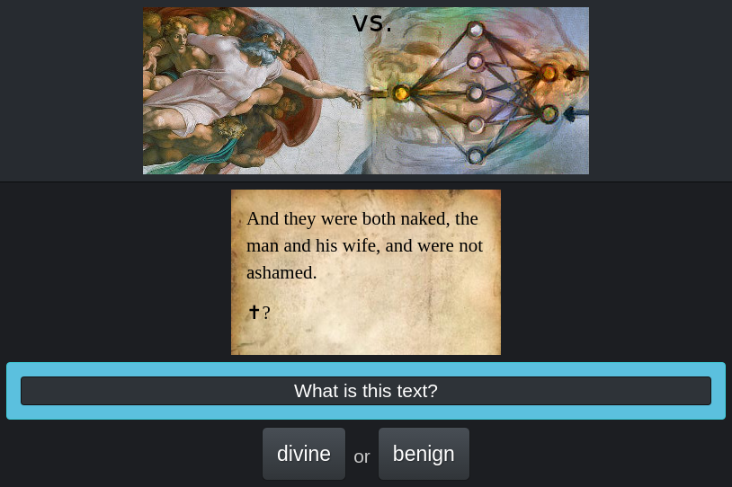

# Divine or Benign – [Play it!](http://www.editgym.com/divine-or-benign/)

### Can you distinguish God from a recurrent neural network?

Assign the shown text to its source, i.e.
[the Bible](https://en.wikipedia.org/wiki/King_James_Version)
or a [RNN](https://en.wikipedia.org/wiki/Recurrent_neural_network)
generating more or less random nonsense.
A RNN is a mathematical model suitable to process text.
The one used here was trained on text from the Bible to be able to match its style.